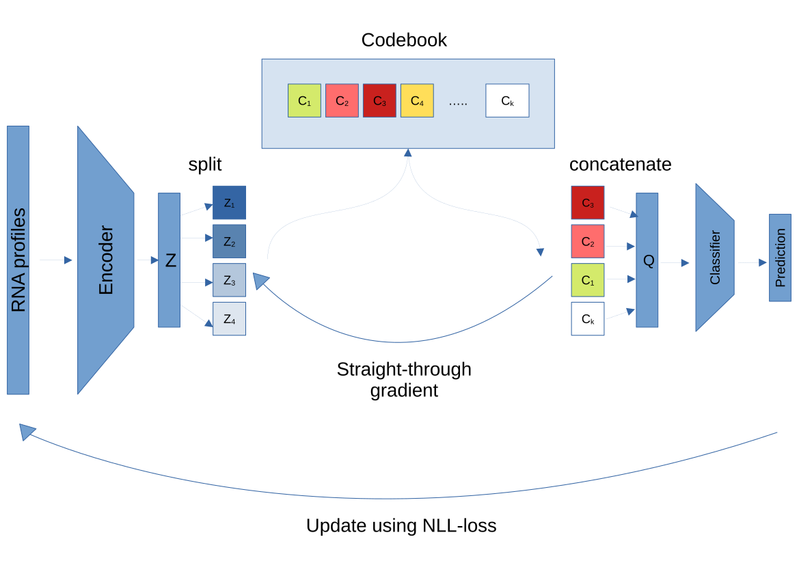

# Single-Cell Vector-Quantization Classifier (scVQC)

We developed the single-cell Vector-Quantization Classifier (scVQC) model for annotating cell types in scRNA-seq data. The scVQC model is designed to both predict cell types accurately and extract cell latent embeddings, achieving performance comparable to foundational models in cell annotation tasks. This model leverages vector quantization to create discrete representations, which helps in distinguishing between cell types with greater clarity and stability.
For an usage, please see [the example notebook](https://github.com/yusri-dh/scVQC/blob/main/example.ipynb).

